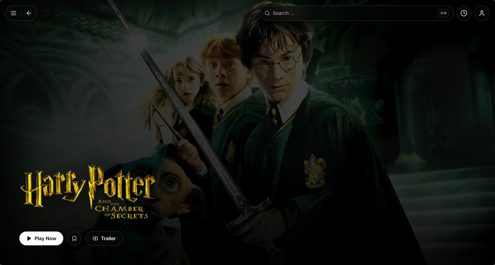
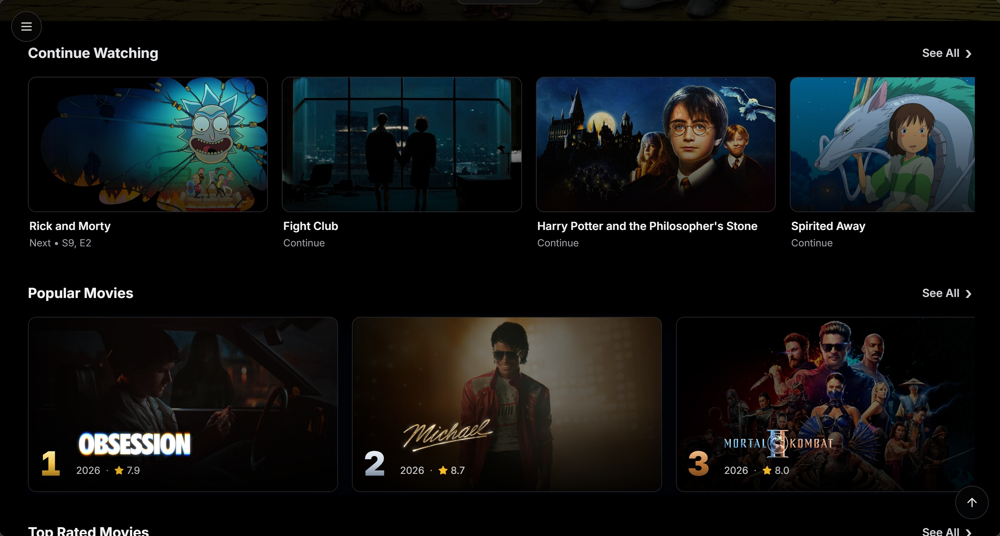

# Luma

<div align="center">
  
</div>

> **Luma** is a cross-platform streaming aggregation app built with **Next.js 14**, **Tailwind CSS**, and **TypeScript**.

<div align="center">


</div>

---

## Features

- 🔎 **Multi-source search**: Search across configured providers and get aggregated results in one place.
- 🎬 **TMDB metadata enrichment**: Posters, backdrops, ratings, cast, collections, and recommendations.
- 🧠 **Personalized recommendation engine**: Build watch-history-aware discovery rails from TMDB recommendations, similar titles, keywords, credits, and ranking signals.
- 🍿 **Movie and TV discovery**: Browse movies, series, curated categories, years, ratings, and runtime filters.
- ⭐ **Favorites and continue watching**: Save favorites, watch history, playback progress, and resume points.
- 🗄️ **Multiple storage backends**: localStorage, Redis, Cloudflare D1, and Upstash Redis.
- 👤 **User management and verified registration**: Manage users from `/admin`, store accounts in D1 or Redis, and require email confirmation before new accounts are activated.
- ✉️ **Polished transactional email**: Send branded verification emails with Resend and React Email templates, including site logo, confirmation CTA, fallback link, and GitHub link.
- 🛠️ **Runtime admin panel**: Manage site settings, users, providers, categories, and system options from `/admin`.
- 📱 **PWA ready**: Offline cache, home-screen installation, and a mobile-friendly experience.
- 🖥️ **Responsive layout**: Desktop sidebar, mobile bottom navigation, and large-screen content rails.

## Screenshots

<p align="center">
  
</p>
<p align="center">
  
</p>
<p align="center">
  
</p>
<p align="center">
  
</p>

## Quick Start

```bash
pnpm install
pnpm dev
```

The development server runs at `http://localhost:3000` by default.

## Deployment

For Docker, Vercel, Cloudflare Workers, storage backends, and environment variables, see [DEPLOYMENT.md](DEPLOYMENT.md).

## Tech Stack

| Area               | Main Dependencies                                                         |
| ------------------ | ------------------------------------------------------------------------- |
| Framework          | [Next.js 14](https://nextjs.org/) App Router                              |
| UI and Styling     | [Tailwind CSS 3](https://tailwindcss.com/), next-themes, Framer Motion    |
| Language           | TypeScript 4                                                              |
| Data and Storage   | localStorage, Redis, Cloudflare D1, Upstash Redis                         |
| Auth and Email     | Username/password login, verified email registration, Resend, React Email |
| Content Enrichment | TMDB API, category feeds, image proxy                                     |
| Code Quality       | ESLint, Prettier, Jest                                                    |
| Deployment         | Docker, Vercel, Cloudflare Workers, OpenNext                              |

## License

[Apache-2.0](LICENSE) (c) 2026 Luma Contributors

## Acknowledgements


- [Next.js](https://nextjs.org/) and [Tailwind CSS](https://tailwindcss.com/): The application framework and styling foundation.
- Thanks to the maintainers of the open-source projects, metadata services, and provider APIs that make this project possible.
